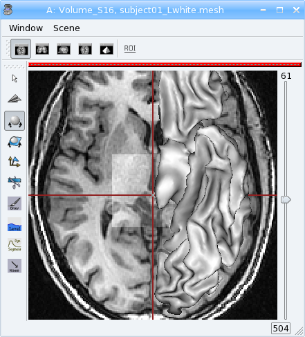
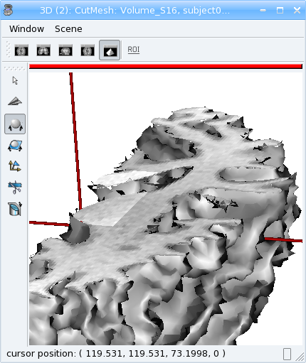

****************************************************************************
PyAnatomist / PyAims tutorial : mixing Anatomist and AIMS in Python language
****************************************************************************

This tutorial documents PyAnatomist and PyAims integration. The reader should probably begin with the separate turorials first:

:doc:`pyanatomist_tutorial`.

:pyaims:`PyAims tutorial <pyaims_tutorial.html>`.

Running PyAnatomist with PyAims
-------------------------------

When PyAnatomist is run in "direct" mode (library bindings), it is possible to share objects between processing routines in pyaims and viewing models in Anatomist, 
and interact on them directly and interactively.

For an interactive shell with Anatomist rendering enabled, IPython should be run in an appropriate mode for graphical events loop to run. 

With IPython version < 0.11:

.. code-block:: bash

        ipython -q4thread

With IPython version >= 0.11:

.. code-block:: bash

        ipython --gui=qt

Or:

.. code-block:: bash

        ipython --pylab=qt

Then, in IPython, start Anatomist in direct mode:

>>> import anatomist.direct.api as ana
>>> a = ana.Anatomist()
global modules: ...

Now Anatomist main window is here.

Sharing objects between Aims and Anatomist
------------------------------------------

Objects loaded in pyaims may be wrapped as Anatomist objects:

>>> from soma import aims
>>> vol = aims.read('data_for_anatomist/subject01/subject01.nii')
>>> anavol = a.toAObject(vol)
>>> win = a.createWindow('Axial')
>>> win.addObjects(anavol)

Or, in the other way, Anatomist objects may be exported as AIMS objects:

>>> anamesh = a.loadObject('data_for_anatomist/subject01/subject01_Lwhite.mesh')
>>> mesh = a.toAimsObject(anamesh)
>>> win.addObjects(anamesh)

Interactive modifications in objects
------------------------------------

Objects may be modified on AIMS side. Then Anatomist must be notified of such modifications so that views on the objects can be refreshed.

>>> import numpy
>>> arr = numpy.asarray(vol)
>>> arr[100:150, 100:150, 50:80] += 200
>>> anavol.setChanged() # say this object has changed
>>> anavol.notifyObservers() # refresh views and other interactions

  3D volume modified with numpy

It is also possible to interact on objects created within Anatomist:

>>> cutmesh = a.fusionObjects([anavol, anamesh], method='FusionCutMeshMethod')
>>> win2 = a.createWindow('3D')
>>> win2.addObjects(cutmesh)
>>> # find the cut sub mesh in cutmesh children
>>> anacutsubmesh = filter(lambda x: x.name.startswith('CutSubMesh'), cutmesh.children)[0]
>>> # get the Aims mesh from it
>>> cutsubmesh = a.toAimsObject(anacutsubmesh)
>>> # now modify the mesh, adding a random value to vertices along the normal
>>> vert = cutsubmesh.vertex()
>>> norm = cutsubmesh.normal()
>>> for v,n in zip(vert, norm):
...     v += n * numpy.random.randn()
>>> anacutsubmesh.setChanged()
>>> anacutsubmesh.notifyObservers()

  
  Modified cut mesh

At the end, close Anatomist:

>>> # remove python references to anatomist objects before closing
>>> del anacutsubmesh, cutsubmesh, cutmesh, win2, anavol, anamesh, win
>>> a.close()

